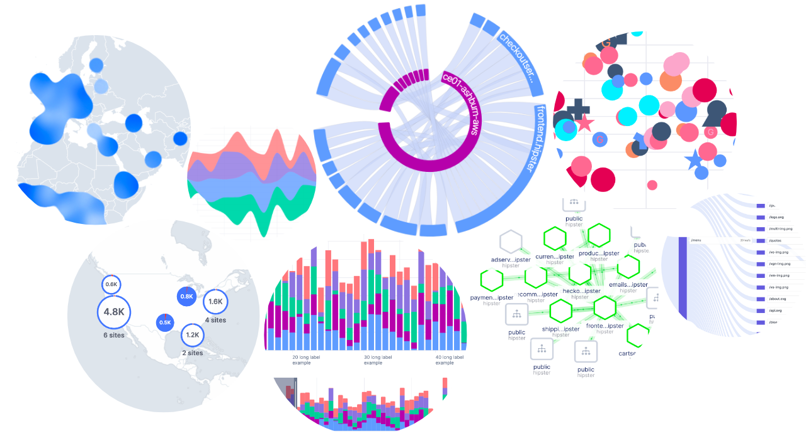

🟨  **Unovis** is a modular data visualization framework for React, Angular, Svelte, and vanilla TypeScript or JavaScript:

* 📈 🗺 It has charts, maps, network graphs, and more!
* 🌳 Tree-shakable and supports individual component imports to reduce your bundle size;
* 🎨 Highly customizable, thanks to the CSS-variables support.

See **Unovis**  in action and read the docs on our website [unovis.dev](https://unovis.dev)

## Installation
The core of the library is written in TypeScript and published as `@unovis/ts` package.

If you want to use Unovis with React, install both `@unovis/ts` and `@unovis/react`:
```bash
npm install -P @unovis/ts @unovis/react
```

For Angular install `@unovis/ts` and `@unovis/angular`:
```bash
npm install -P @unovis/ts @unovis/angular
```

For Svelte, install `@unovis/ts` and `@unovis/svelte`:
```bash
npm install -P @unovis/ts @unovis/svelte
```

Or if you want to use it with vanilla TypeScript or JavaScript, only the core package will be needed:
```bash
npm install -P @unovis/ts
```

## Examples and Documentation
[](https://unovis.dev/gallery)

Unovis has a great [documentation](https://unovis.dev/docs) with code snippets for React, Angular,
Svelte and TypeScript; and a growing [gallery](https://unovis.dev/gallery) of examples for various chart types
(just pick the one you like and copy the code over to your project).

## Repository structure

* `packages/vis` Core TypeScript package
* `packages/vis-angular` Angular components
* `packages/vis-react` React components
* `packages/vis-svelte` Svelte components
* `packages/website` Website, docs and examples

## Contributing
Coming soon

## Code of Conduct
Coming soon

## Authors
[](https://github.com/rokotyan)
[](https://github.com/reb-dev)

## Contributors
[](https://github.com/stukova)
[](https://github.com/sumitkumar25)
[](https://github.com/gmfun)
[](https://github.com/beverlyckh)
[](https://github.com/DimamoN)

## License
Apache-2.0
