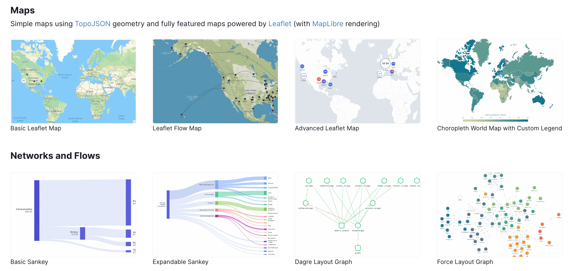

https://user-images.githubusercontent.com/755708/205744216-5e9efd10-794b-4ce1-9aca-580c34fad193.mp4

🟨  **Unovis** is a modular data visualization framework for React, Angular, Svelte, Vue, Solid and vanilla TypeScript or JavaScript:

* 📈 🗺 It has charts, maps, network graphs, and more!
* 🌳 Tree-shakable and supports individual component imports to reduce your bundle size;
* 🎨 Highly customizable, thanks to the CSS-variables support.

Learn more about _Unovis_ on [unovis.dev](https://unovis.dev)

## Quick Start
You can install the core of the library `@unovis/ts` and framework-specific packages (if you use React, Angular, Svelte, Vue or Solid) from NPM:

```bash
npm install -P @unovis/ts @unovis/<react|angular|svelte|vue|solid>
```

Now you can import components and create your first chart! Here's how to build a simple line chart uising Unovis and React:

```tsx
import React, { useCallback } from 'react'
import { VisXYContainer, VisLine, VisAxis } from '@unovis/react'

type DataRecord = { x: number; y: number }
const data: DataRecord[] = [
  { x: 0, y: 0 },
  { x: 1, y: 2 },
  { x: 2, y: 1 },
]

export function BasicLineChart (): JSX.Element {
  return (
    <VisXYContainer data={data}>
      <VisLine<DataRecord>
        x={useCallback(d => d.x, [])}
        y={useCallback(d => d.y, [])}
      ></VisLine>
      <VisAxis type="x"></VisAxis>
      <VisAxis type="y"></VisAxis>
    </VisXYContainer>
  )
}
```
Looking for Angular, Svelte, Vue, Solid or TypeScript examples? Check out the [Quick Start](https://unovis.dev/docs/quick-start) page on our website.

## Examples and Documentation
[](https://unovis.dev/gallery)

📖 _Unovis_ has an extensive [documentation](https://unovis.dev/docs/intro) with code snippets for React, Angular,
Svelte and TypeScript.

🖼 Also there's a growing [gallery](https://unovis.dev/gallery) of examples, from where you can copy the code over to your project or try it live on StackBlitz.

## Repository structure

<a href="https://github.com/f5/unovis/blob/main/LICENSE"></a>

| Package | Description | Version | Downloads |
|---------|-------------|---------|-----------|
| [`@unovis/ts`](packages/ts) | Core TypeScript package | <a href="https://npmx.dev/package/@unovis/ts"></a> | <a href="https://npmx.dev/package/@unovis/ts"></a> |
| [`@unovis/react`](packages/react) | React components | <a href="https://npmx.dev/package/@unovis/react"></a> | <a href="https://npmx.dev/package/@unovis/react"></a> |
| [`@unovis/angular`](packages/angular) | Angular components | <a href="https://npmx.dev/package/@unovis/angular"></a> | <a href="https://npmx.dev/package/@unovis/angular"></a> |
| [`@unovis/svelte`](packages/svelte) | Svelte components | <a href="https://npmx.dev/package/@unovis/svelte"></a> | <a href="https://npmx.dev/package/@unovis/svelte"></a> |
| [`@unovis/vue`](packages/vue) | Vue components | <a href="https://npmx.dev/package/@unovis/vue"></a> | <a href="https://npmx.dev/package/@unovis/vue"></a> |
| [`@unovis/solid`](packages/solid) | Solid components | <a href="https://npmx.dev/package/@unovis/solid"></a> | <a href="https://npmx.dev/package/@unovis/solid"></a> |
| [`@unovis/ssr`](packages/ssr) | Server-side rendering: charts to SVG/PNG in Node | <a href="https://npmx.dev/package/@unovis/ssr"></a> | <a href="https://npmx.dev/package/@unovis/ssr"></a> |
| [`@unovis/mcp`](packages/mcp) | MCP server generating charts as SVG | <a href="https://npmx.dev/package/@unovis/mcp"></a> | <a href="https://npmx.dev/package/@unovis/mcp"></a> |
| [`packages/website`](packages/website) | Website, docs and examples | — | — |

## Contributing
Pull requests are welcome. For major changes, please open an issue
first to discuss what you would like to change. For more information, please
read [CONTRIBUTING](CONTRIBUTING.md).

## Maintainers
[](https://github.com/rokotyan)
[](https://github.com/lee00678)
[](https://github.com/suryahanumandla)

## Contributors
[](https://github.com/reb-dev)
[](https://github.com/stukova)
[](https://github.com/sumitkumar25)
[](https://github.com/gmfun)
[](https://github.com/beverlyckh)
[](https://github.com/DimamoN)
[](https://github.com/zernonia)
[](https://github.com/yanneves)
[](https://github.com/TasoOneAsia)
[](https://github.com/joshlarsen)

## License
_Unovis_ is licensed under Apache-2.0
