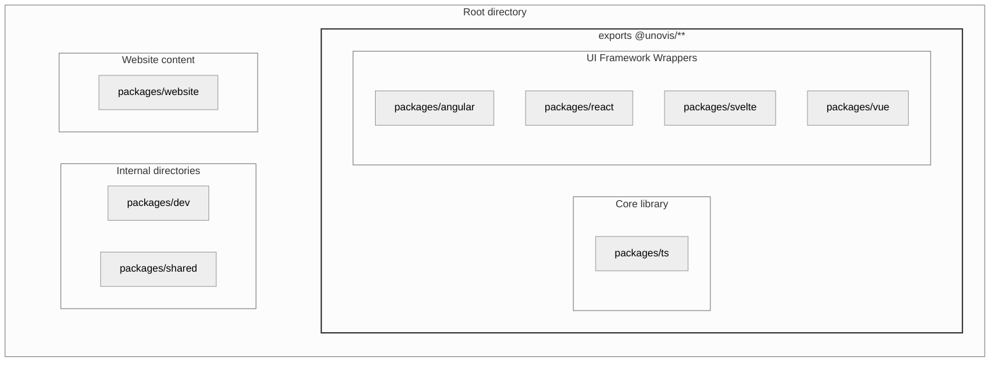
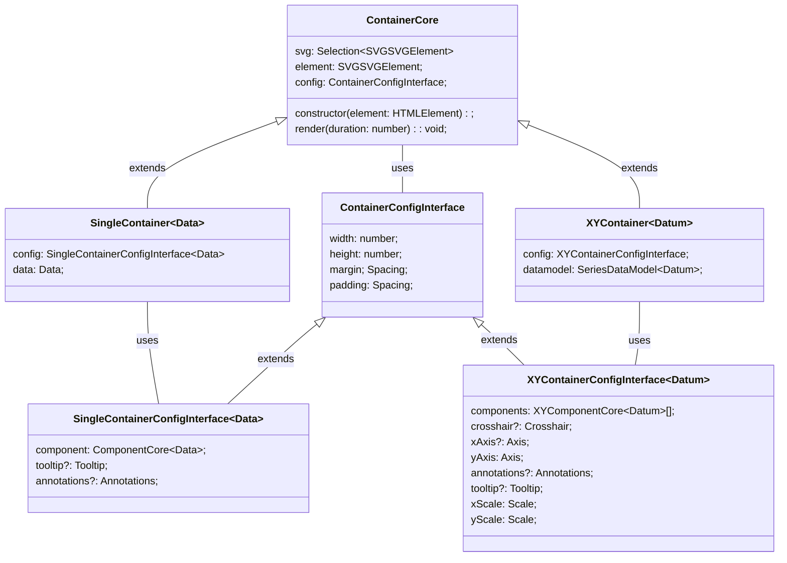
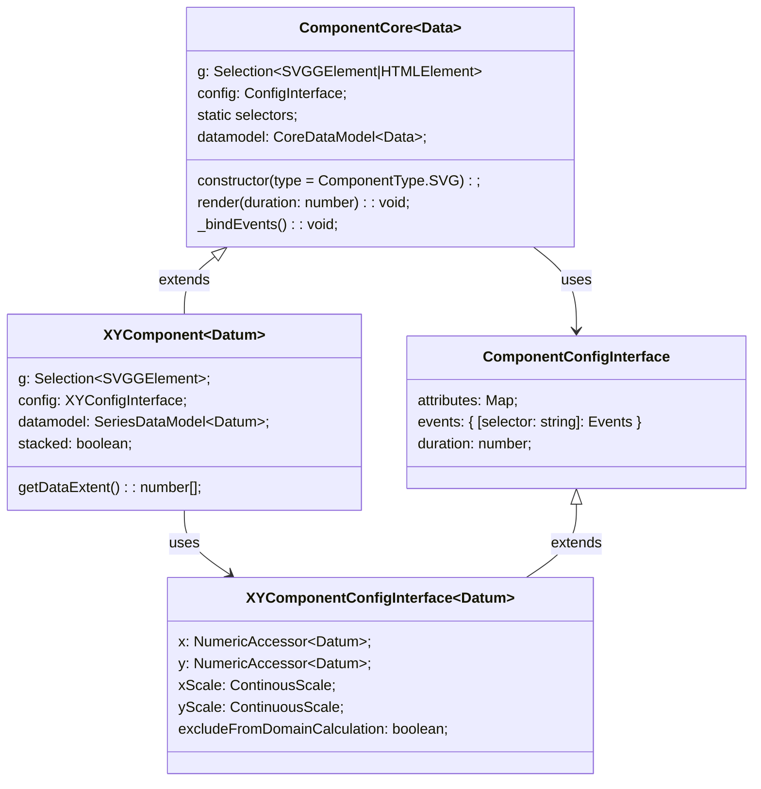
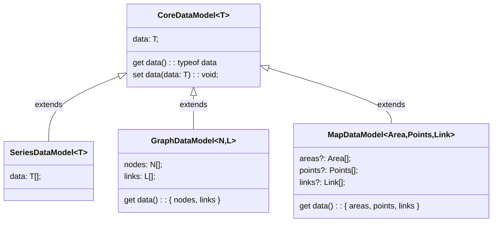
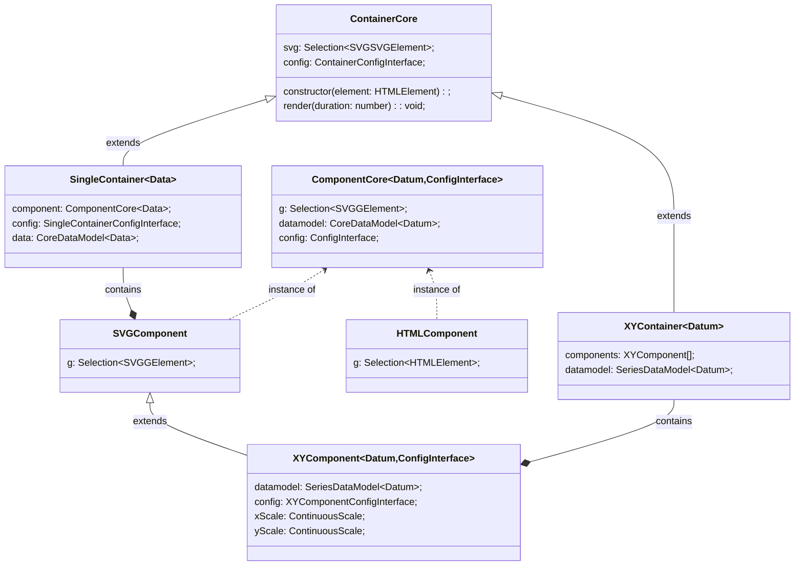

## File Structure
A contents of the Unovis repo is contained in the `packages` directory:

```yaml
packages
├── angular # exports @unovis/angular 
├── dev # dev demo app
├── react # exports @unovis/react
├── shared # shared code and integrations
├── svelte # exports @unovis/svelte
├── ts # core library; exports @unovis/ts
├── vue # UI framework wrapper
├── website # unovis.dev website
```




## Core Library
The core library is a collection of **components** and **containers** built with TypeScript.
These are imported by the wrappers or can be used directly when importing `@unovis/ts`.
Every entity has a `config` object that is used to configure the component and a `render` method.
Containers and most components are data-bound, meaning they have a `datamodel` property that is used to render the component.

### Containers
Containers are the top-level components that contain one or more components.
They are responsible for rendering its children, and managing the data that is passed to them.
On the DOM, containers are `<svg>` elements that it renders its children into.

Container configurations generally define size and spacing.
XYContainers have additional properties to support multiple XY components and align them on the same scale.



### Components
Components are generally designed to be rendered as `g` elements inside of a container, but in some cases they will be rendered as `divs`.
See the [SVG vs. HTML components](./guides/adding-a-component#svg-vs-html-components) section of our component guide for more information.

Like containers, components extend from a common class: `ComponentCore`.
Some components are XYComponents, which have additional properties to support rendering on an XY scale.

Every component has three shared config properties:
- `events` - a map of event handlers
- `attributes` - a map of attributes to apply to specific selectors
- `duration` - the duration (ms) of data update transitions

Components also have static `selectors` (hashed class names) that are used to bind data to the DOM.
Users can use them to define events and attributes through the component's config.




### Data Models
Each data-bound component has a specific data model that it expects to receive:

- _SeriesDataModel_ - for an array of any type
- _GraphDataModel_ - for nodes and links
- _MapDataModel_ - used by map components and contain points and sometimes links or areas



### Summary

