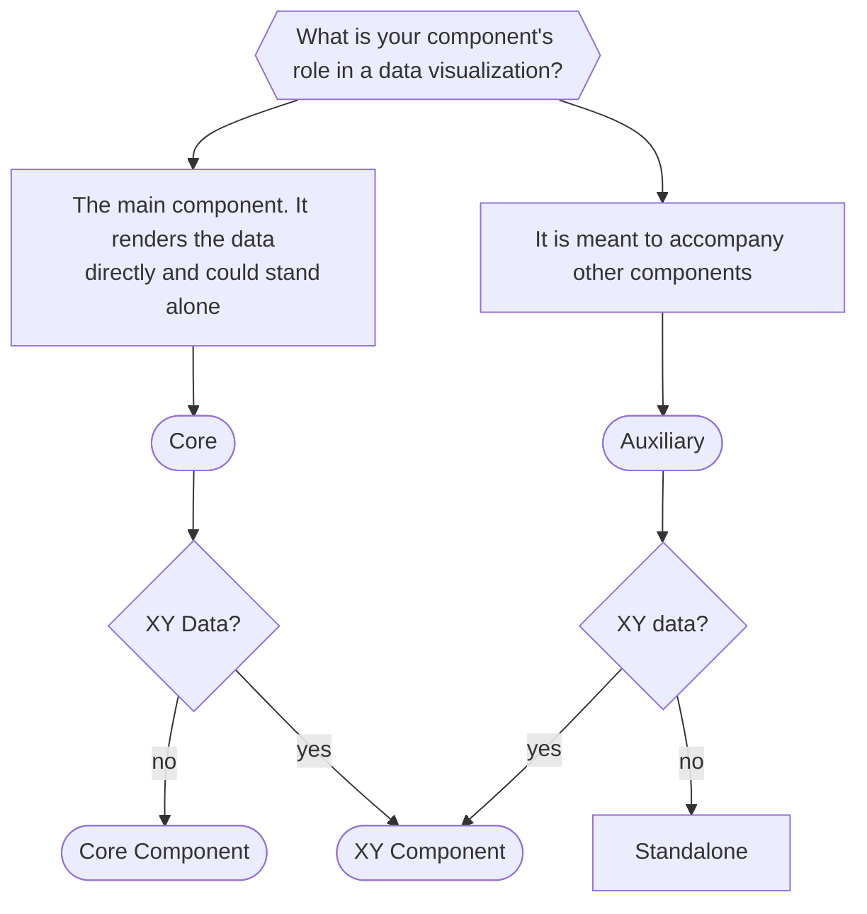

import Tabs from '@theme/Tabs'
import TabItem from '@theme/TabItem'

# How to Add a Component to Unovis
This guide will take you through the steps of adding a new component to our library.

## Prerequisites
Before you start, make sure you familiarize yourself with our library's
[architecture](../architecture). You should also be comfortable working with
[TypeScript](https://www.typescriptlang.org) and [D3](https://d3js.org).

## Getting Started
### SVG vs HTML components
SVG components are rendered as `g` elements, and therefore are designed to exist inside of a `svg`
container (_XYContainer_ or _SingleContainer_). HTML elements are designed to stand alone. In
general, "core" components that display data (i.e. charts, plots and diagrams) will be SVGs and
auxiliary components (i.e. annotations, legends and tooltips) will be HTML. Note the following
exceptions:

* A core component will be type HTML in special cases, for example when HTML canvas is needed for
rendering (i.e. LeafletMap)
* An auxiliary component should be SVG if it is designed to exclusively work with XY data,
in which case it should extend the _XYComponentCore_ superclass which uses SVG type

### Data Types
An important thing to consider beforehand is your component's expected data type. This will
determine the component's superclass (if applicable), the corresponding `datamodel` and generics.

We use the Series data model for components that expect an array of arbitrary values (type `any[]`).
This is the model used by XY Components and simpler charts like _Donut_. For more complex types, we
have `Graph` and `MapGraph` datamodels, which expect links that connect arbitrary data values through
`source` and `target` properties.

| Data model | typeof data  |
| ---------- | -----------  |
| Series     | `any[]`    |
| Graph      | `{ nodes: N[]; links: L[] }` | |
| MapGraph   | `{ areas?: any[]; points?: N[]; links?: L[]; }` |

where N extends NodeDatum and Link extends LinkDatum as defined below:

```ts
export interface NodeDatum {
  id?: string;
}

export interface LinkDatum {
  id?: number | string;
  source: number | string | NodeDatum;
  target: number | string | NodeDatum;
}
```

:::note
These data formats are not strictly defined because we also utilize accessor functions throughout the
library in `config` files. For example, _NodeDatum_ could contain an `id` property, but to allow for
flexibility it would also be recommended to add a `nodeId` property to the component's configuration
with the type `StringAccessor<NodeDatum>`.
:::

### XY/Core vs Standalone components
Data-bound components are considered `Core` and belong in a container. There are two subtypes:
**XY Components** are for plotting data on XY axes/coordinate system and should extend
`XYComponentCoreInterface` and **Core Components** are for plotting any other kind of data and should
extend `ComponentCoreInterface`.

Auxiliary components should not extend from a superclass unless
there is a valid reason to do so (for example if it is meant to work with XY data).



## Component Code
### File Structure
Your component will exist in the `@unovis/ts` library. Once you decide on a name for the component,
create a new directory inside `src/components` called _your-component-name_. Note that we use kebab
case naming convention for all files in this package.

The component directories follow this structure:
```yaml
component-name
├── modules
│   └── # any extraneous logic/helper functions belong here in separate files
├── config.ts # ┓
├── index.ts  # ┠ core files
├── style.ts  # ┛
├── types.ts # any component-specific custom types go here
```

### Configuration
The logic for component configuration is contained in `config.ts`. This file defines the configuration
properties and sets default values for those properties.
The general structure looks like:

```ts title=config.ts
export interface ConfigInterface {
  /** Property JSDoc. Default value: `` */
}
export class Config implements ConfigInterface {
  // Default values
}
```

In most cases (i.e. for any non stand-alone component), _Config_ and _ConfigInterface_ should also extend
their corresponding super classes. (`ComponentConfig` and `ComponentConfigInterface` for Core components,
`XYComponentConfig` and `XYComponentConfigInterface` for XY components).

### Selectors and Styling
The `style.ts` file declares selectors and sets default styles. Think of selectors as the
structural building blocks that make up your component. (For example, _Scatter_ contains a selector
labeled "point", each of which are  rendered as a SVG `circle` elements and have various SVG properties).
Any CSS variables will also be initialized in this file.

The general template for a `style.ts` file looks like:

```ts title=style.ts
import { css } from '@emotion/css'
import { getCssVarNames, injectGlobalCssVariables } from 'utils/style'

export const root = css`
 label: component-name;
`
const cssVarDefaults = {
  /* Mapping of CSS variables and their default values go here */
}

export const variables = getCssVarNames(cssVarDefaults)
injectGlobaleCSSVariables(cssVarDefault, root)

export const selectorName = css`
  label: selector-name;
  /* Style declarations for selector-name go here */
`
```

#### CSS Variables
Any component level variables you wish to introduce should be included as keys in `cssVarDefaults` object.
Each one should be named accordingly:

`--vis-component-name-selector-name-property-name`

Any color variable should have a corresponding dark theme variable with the prefix `--vis-dark`.

Then`getCSSVarNames` converts each variable name into a camel case format so you can use them
with ease in your TypeScript files.

<details open>
<summary>Example</summary>
A small illustration of how CSS variables and selectors are applied in Donut's style file.

```ts title=donut/style.ts
export const root = css`
  label: donut-component;
`

export const cssVarDefaults = {
  '--vis-donut-background-color': '#E7E9F3',
  '--vis-dark-donut-background-color': '#18160C',
}

export const variables = getCssVarNames(cssVarDefaults)
injectGlobaleCSSVariables(cssVarDefault, root)

export const background = css`
  label: background;
  fill: var(${variables.donutBackgroundColor});
`
```
</details>

### Class Overview
The logic for rendering the component takes place in the `index.ts` file, which
exports your component class. The general structure looks like:

```ts title=index.ts
import { Config, ConfigInterface } from './config'
import * as s from './style'

export class Component<Datum> {
  static selectors = s
  static cssVariables = s.variables
  config: Config<Datum> = new Config()
  events = {}

  // Private fields

  constructor (config?: ConfigInterface<Datum>) {...}

  // Class methods
}
```

Your class declaration will look slightly different depending on the type of component
you're writing. _XYComponents_ and _CoreComponents_ should always extend from their corresponding
super class. For data-bound components, you should also include your `datamodel` declaration
(except for XY Components, since the superclass already declares it).

#### File Templates
<details>
<summary>Index File Templates</summary>
<Tabs groupId="component">
  <TabItem value="XYComponent">

```ts
// Core
import { XYComponentCore } from 'core/xy-component'

import { Config, ConfigInterface } from './config'
import * as s from './style'

export class YourComponent<Datum> extends XYComponentCore<Datum, Config<Datum>, ConfigInterface<Datum>> {
  static selectors = s
  static cssVariables = s.variables
  config: Config<Datum> = new Config()
  events = {}

  constructor (config?: ConfigInterface<Datum>) {
    super()
    if (config) this.config.init(config)

    this.g.attr('class', s.root)
  }

  _render (customDuration?: number): void {

  }
}
```
  </TabItem>
    <TabItem value="coreSVG" label="Core Component (SVG)">

```ts title=index.ts
// Core
import { ComponentCore } from 'core/component'

import { Config, ConfigInterface } from './config'
import * as s from './style'

export class YourComponent<Datum> extends ComponentCore<Datum, Config<Datum>, ConfigInterface<Datum>> {
  static selectors = s
  static cssVariables = s.variables
  config: Config<Datum> = new Config()
  events = {}

  constructor (config?: ConfigInterface<Datum>) {
    super()
    if (config) this.config.init(config)
    this.g.attr('class', s.root)
  }

  _render (customDuration?: number): void {
    
  }
}
```
  </TabItem>
      <TabItem value="coreHTML" label="Core Component (HTML)">

```ts title=index.ts
// Core
import { ComponentCore } from 'core/component'

// Types
import { ComponentType } from 'types/component'

import { Config, ConfigInterface } from './config'
import * as s from './style'

export class YourComponent<Datum> extends ComponentCore<Datum, Config<Datum>, ConfigInterface<Datum>> {
  static selectors = s
  static cssVariables = s.variables
  config: Config<Datum> = new Config()
  events = {}
  type = ComponentType.HTML

  protected _container: HTMLElement

  constructor (container: HTMLElement, config?: ConfigInterface<Datum>, data?: Datum[]) {
    super(this.type)
    if (config) this.config.init(config)
    this._container = container
    this.g.attr('class', s.root)
  }

  _render (customDuration?: number): void {
    
  }
}
```
  </TabItem>
  <TabItem value="standalone" label="Stand Alone">

```ts title=index.ts
import { Config, ConfigInterface } from './config'

import * as s from './style'

export class YourComponent {
  static selectors = s
  config: Config = new Config()
  events = {}

  private _container: HTMLElement

  constructor (container: HTMLElement, config?: ConfigInterface) {
    this._container = container
  
    if (config) this.config.init(config)
    this.g.attr('class', s.root)
  }

}
```
  </TabItem>
</Tabs>
</details>


### The `render` function
Every component should have a `render` function (or `_render` if you are extending from a superclass),
which is where the logic for rendering the component takes place. It is important to have clearly defined
`enter`, `update` and `exit` functionality so that the component can react to data updates correctly.
(This is a helpful guide for understanding [how transitions work in [D3](https://www.d3indepth.com/enterexit))

We use the following convention inside `render`:
```ts
const selection  = this.g.selectAll<ElementType, DataType>(s.selectorName)
  .data(data, /* unique identifier function */)
    
const selectionEnter = selection.enter().append(/* element type */)
  .attr('class', s.selectorName)
  // enter properties here

const selectionMerged = selection.merge(selectionEnter)
  // update properties here

const selectionExit = selection.exit()
  // exit properties here
  .remove()
```

#### Using Modules
If you notice your render function becoming too lengthy, we recommend extracting the logic into
a separate file in the `modules` directory for the sake of code clarity. This way you can use the
`call` function on the selection instead of chaining a series of `attr` or `style` calls.

There are many examples of this throughout the code base, but here is a small example of how you
might use the module approach in your component to render circles:

```ts title=modules/circle.ts
export function updateCircle<Datum> (
  selection: Selection<SVGCircleElement, Datum, SVGGElement, unknown>,
  config: Config<Datum>,
  duration?: number,
): void {
  /** update logic goes here */
}
```

```ts title=index.ts
const circlesMerged = circles.merge(circlesEnter)
  .call(updateCircle, this.config, duration)
```

## Updating the Wrappers
We have five wrappers for our library for usage in other frameworks: `@unovis/angular`,
`@unovis/react`, `@unovis/svelte`, `@unovis/vue` and `@unovis/solid`. Each can be found in their named directory in `packages`.
Before your component is complete you will have to add it to each wrapper. Luckily we've streamlined
this process in the `autogen` directory of each wrapper. You will just need to do the following steps:

1. Add the component's info to the `components` array in `autogen/index.ts`
2. In the wrapper's root directory, run the following command:
  
  ```bash
  npm run generate
  ```
3. Take a look at the generated component to see if it looks right. If not, you may need to manually
write the component.

## Visual Testing
To visually test library components we use a react app located in the `packages/dev` directory. To run
it, from the root directory run:
```bash
npm run dev
```
and navigate to [localhost:9500](http://localhost:9500).

To add your own example page to the dev app, add a `.tsx` file to the `dev/src/examples/` directory
in its appropriate category directory. The general structure for each file path is:

> `examples/category/component/example/index.tsx`

The file should include the following at a minimum:

```tsx
import React, { useState } from 'react'

/* Title and subtitle for the sidebar */
export const title = ''
export const subTitle = ''

export const component = (): JSX.Element => {
  /* Your test component here */
}
```

## Adding Documentation
Please add a doc page for your component so others will understand how to use it.
You can find our documentation pages in the `packages/website/docs` directory.

### Local Setup
To run a local instance of the website, run:

```bash
npm run website
```
and navigate to [localhost:9300](https://localhost:9300/docs).

### MDX File Structure
The files for our components generally follow this structure:

```markdown title=Component.mdx
## Basic Configuration
The minimal/most basic way your component can be used.

<!--
  This section should contain descriptions of
  how to use the properties in your config
--->

## CSS Variables
A list of CSS variables and their default values

## Events
Supported events

## Component Props
A prop table generated from your JSDocs
```

### Resources
Our website is built with [Docusaurus](https://docusaurus.io/). We highly recommend checking out
their extensive [documentation](https://docusaurus.io/docs) for reference.

#### Helper Components
Although not required, we have components available that are designed to streamline the doc-writing process.
You can see many examples of how they are used throughout the docs directory, but here is a brief
description of what they do:

* `DocWrapper` - generates code snippets with rendered example below it (there are a few other variations,
all of which can be found in the `wrappers` directory)
* `PropsTable` - generates the Component Props table at the bottom of each doc page
* `CSSVariables` - generates a CSS code block of computed CSS variable values

## Final Checklist
Your component is considered ready when:
- [x] The `@unovis/ts` files are complete and everything compiles
- [x] It has at least one page in the dev app
- [x] It is exported by each wrapper library (`@unovis/angular`, `@unovis/react`, `@unovis/svelte`, `@unovis/vue` and `@unovis/solid`)
- [x] It has a doc page on the website
- [x] It is featured in the gallery (see our guide for how to add a gallery example [here](../../gallery))

Once is it ready, feel free to make a [pull request](../intro#pull-requests).
We look forward to adding your component to the library!
