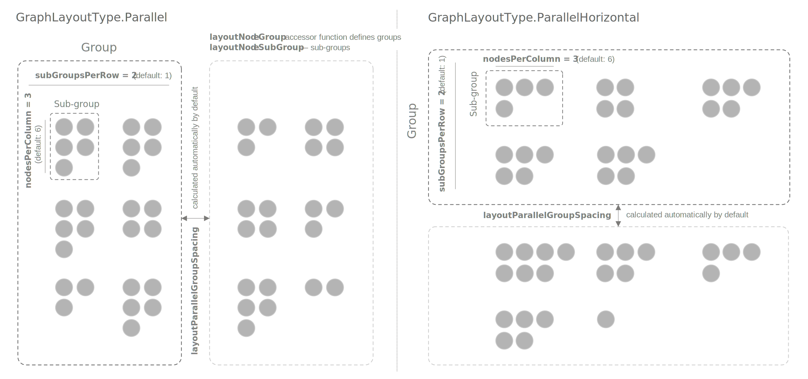

import CodeBlock from '@theme/CodeBlock'
import BrowserOnly from '@docusaurus/BrowserOnly'
import { PropsTable } from '@site/src/components/PropsTable'
import { scaleLinear } from 'd3-scale'
import { DocWrapper, InputWrapper } from '../wrappers'
import { generateNodeLinkData, sample } from '../utils/data'

export const defaultProps = () => ({
  name: "Graph",
  configKey: "component",
  hiddenProps: {
    disableZoom: true,
    disableDrag: true,
  },
  containerName: "SingleContainer",
  height: 400,
  dataType: "NodeDatum, LinkDatum",
  data: generateNodeLinkData()
})

export const linkHiddenProps = {
    ...defaultProps().hiddenProps,
    nodeSize: 12,
    linkStroke: '#737E92  ',
  }

export const GraphDoc = (props) => props.inputType
  ? <InputWrapper {...defaultProps()} {...props}/>
  : <DocWrapper {...defaultProps() } {...props}/>


export const nodeShapeData = generateNodeLinkData(10)

export const nodeIcons = ['☁︎', '☂︎', '☀︎', '✤', '❃', '✻', '☎︎']
export const getNodeIconByIndex = (i) => nodeIcons[i % nodeIcons.length]
export const getNodeSideLabels = (d, i) => i === 5
  ? [{ text: '🏈', color: '#eee'}, { text: '⚾️', color: '#FF351D' }]
  : [{ text: i*2, color: '#eee', radius: 8 }]

export const palette = ['#4580C0', '#D9C6BB', '#FED651', '#8E8D95', '#BEB18B', '#E2203A']
export const getColorByIndex = (i) => palette[i % palette.length]
export const getRandomColor = () => sample(palette)
export const gradient = scaleLinear().range(['#E2203A', '#FED651', '#3ECC5F']).domain([0, 50, 100])

The _Graph_ component has been designed to visualize network graphs with a relatively low number of nodes and links, but
with a good level of detail. Nodes can be different shapes, have multiple icons, labels, and more. Links can have arrows,
labels, bands and flying particles representing active traffic. There are several built-in graph layouts such as:
force layout, dagre, circular, concentric and parallel. During the development of the _Graph_ component, a lot of attention
has been paid to the animations and data transitions to make the component act as a complex UI element.

## Data
_Graph_ expects the data to be an object with `nodes` and `links` arrays:
```ts
type GraphData = {
  nodes: NodeDatum[];
  links: LinkDatum[];
}
```

The `NodeDatum` object type in generic and doesn't have any mandatory fields, however we recommend adding unique `id`s to
each node to support better graph animations. Your links will need to have the `source` and `target` properties referencing
specific nodes either by their index in the `nodes` array or by their unique `id`; or they can be references to the
actual node objects.

```ts
type NodeDatum = {
  id?: string;
}

type LinkDatum = {
  id?: string;
  source: number | string | NodeDatum;
  target: number | string | NodeDatum;
}
```
## Basic Configuration

_Graph_ is a component that works inside _Single Container_. By default, _Graph_ will render your network using force
layout and will display nodes as circles.

<GraphDoc showContext="full"/>

## Nodes
### Shape and Size
Shape and size of the nodes can be set with the `nodeShape` and `nodeSize` config properties. They can accept either a
constant value or an accessor function.

The following node shapes are supported: `Shape.Circle` (`"circle"`),
`Shape.Square` (`"square"`), `Shape.Hexagon` (`"hexagon"`), and `Shape.Triangle` (`"triangle"`).

`nodeSize` sets the diameter of the node in pixels at zoom level `1`. Keep in mind that _Graph_ will automatically choose
zoom level at initialization to fit to the size of the container.

<GraphDoc
  showContext="minimal"
  nodeShape={(n, i) => (['square', 'circle', 'hexagon', 'triangle'])[i % 4]}
  nodeSize={50}
/>

### Custom SVG Nodes
Alternatively, you can provide `nodeShape` property with custom SVGs to get the exact shape you want.
You can either provide it directly as a string in your _StringAccessor_ or for better control over the
element, put the shape(s) definition in the container's `svgDefs` property and reference it with
[`use`](https://developer.mozilla.org/en-US/docs/Web/SVG/Element/use) tag. For more information on
providing custom `svgDefs`, visit our [doc](/docs/guides/tips-and-tricks#custom-fills-with-svg-defs) about it.

Here is an example using the `svgDefs` approach and where every _node_ has the following type:

```ts
type NodeDatum = {
  id: string;
  shape: 'blob' | 'cloud' | 'diamond' | 'house'
}
```

<GraphDoc
  showContext='full'
  containerProps={{
    svgDefs: `
    <polygon id="house" points="4,18 4,30 13,30 13,24 17,24 17,30 26,30 26,18 30,18 15,0 0,18"/>
    <path id="blob" d="M 19.415 1.0564 C 20.585 2.47 20.225 5.89 21.665 8.2612 C 23.06 10.678 26.345 12.046 28.325 14.554 C 30.305 17.1076 31.025 20.8012 28.865 21.9412 C 26.75 23.1268 21.755 21.7588 18.605 23.3092 C 15.455 24.8596 14.105 29.3284 12.485 29.8756 C 10.865 30.3772 8.93 27.0028 6.41 25.042 C 3.89 23.1268 0.83 22.6708 0.38 20.9836 C -0.07 19.2964 2.135 16.378 2.54 13.642 C 2.945 10.9516 1.55 8.4892 2.135 7.03 C 2.72 5.5708 5.285 5.1148 7.355 4.294 C 9.47 3.4276 11.135 2.1964 13.34 1.2388 C 15.545 0.3268 18.245 -0.3116 19.415 1.0564 Z"/>
    <path id="cloud" d="M 14 -1 A 9 9 90 0 0 5 8 A 9 9 90 0 0 5.1055 9.3125 A 6 6 90 0 0 1 15 A 6 6 90 0 0 7 21 L 22 21 A 7 7 90 0 0 29 14 A 7 7 90 0 0 22.9414 7.0703 A 9 9 90 0 0 14 -1 z"/>
    <polygon id="diamond" points="2,15 15,0 28,15 15,30"/>
  `}}
  declarations={{
    svgDefs: `\`
    <path id="blob" d="M 19.415 1.0564 C 20.585 2.47 20.225 5.89 21.665 8.2612 C 23.06 10.678 26.345 12.046 28.325 14.554 C 30.305 17.1076 31.025 20.8012 28.865 21.9412 C 26.75 23.1268 21.755 21.7588 18.605 23.3092 C 15.455 24.8596 14.105 29.3284 12.485 29.8756 C 10.865 30.3772 8.93 27.0028 6.41 25.042 C 3.89 23.1268 0.83 22.6708 0.38 20.9836 C -0.07 19.2964 2.135 16.378 2.54 13.642 C 2.945 10.9516 1.55 8.4892 2.135 7.03 C 2.72 5.5708 5.285 5.1148 7.355 4.294 C 9.47 3.4276 11.135 2.1964 13.34 1.2388 C 15.545 0.3268 18.245 -0.3116 19.415 1.0564 Z"/>
    <path id="cloud" d="M 14 -1 A 9 9 90 0 0 5 8 A 9 9 90 0 0 5.1055 9.3125 A 6 6 90 0 0 1 15 A 6 6 90 0 0 7 21 L 22 21 A 7 7 90 0 0 29 14 A 7 7 90 0 0 22.9414 7.0703 A 9 9 90 0 0 14 -1 z"/>
    <polygon id="diamond" points="0,15 15,0 30,15 15,30"/>
    <polygon id="house" points="4,18 4,30 13,30 13,24 17,24 17,30 26,30 26,18 30,18 15,0 0,18"/>
  \``}}
  data={{
    nodes: nodeShapeData.nodes.map((n, i) => ({ ...n, shape: ['blob', 'cloud', 'diamond', 'house'][i % 4]})),
    links: nodeShapeData.links,
  }}
  height={300}
  nodeLabel={n => n.shape}
  nodeShape={n => `<use href="#${n.shape}" stroke-width="3"/>`}
/>

Note that depending on your SVG, it may require some additional tweaking to get the appearance you want.
For example, custom nodes would require `stroke-width`, or `fill` attributes if not already defined.
It may also be necessary to tweak your shape size to fit into the bounds of your configured `nodeSize`,
like this example:

<GraphDoc
  hideTabLabels
  nodeSize={50}
  nodeShape={`<image width='50' height='50' href='https://upload.wikimedia.org/wikipedia/commons/7/7e/Sphere_-_monochrome_simple.svg'/>`}
/>

### Fill and Stroke
Use the `nodeFill` and `nodeStroke` properties to set node's fill and stroke color. A custom stroke width can be
provided to `nodeStrokeWidth`.

<GraphDoc
  showContext="minimal"
  nodeFill={(n, i) => getColorByIndex(i)}
  nodeStroke={(n, i) => getColorByIndex(i + 1)}
  nodeStrokeWidth={(d, i) => 1 + i * 3}
/>

### Icons and Labels
#### In the center
Nodes can have icons (when using an icon font) in the center, which you can set by providing the
`nodeIcon` accessor function in the config. By default, the icon will fit to the size of the node. You can set custom
icon size in pixels with the `nodeIconSize` property.

The component will automatically choose the icon color (dark or light) based on the node's fill color. You can change
the dark and light colors with the `--vis-graph-node-icon-fill-color-bright` and `--vis-graph-node-icon-fill-color-dark`
CSS variables.

The icon font can be set via the `--vis-graph-icon-font-family` CSS variable.

<GraphDoc
  showContext="minimal"
  nodeIcon={(n, i) => getNodeIconByIndex(i)}
  nodeIconSize={(n, i) => 10 + i}
  nodeFill={(n, i) => getColorByIndex(i) }
/>

#### At the bottom
Node label and sub-label can be set by providing the `nodeLabel` and `nodeSubLabel` accessor functions.

:::tip
By default, long labels will be trimmed and displayed in full only on hover. You can control that behaviour via the
`nodeLabelTrim` and `nodeSubLabelTrim` config properties.

You can also configure how trimming works by specifying custom  `nodeLabelTrimMode`, `nodeLabelTrimLength`, `nodeSubLabelTrimMode`,
and `nodeSubLabelTrimLength` values.
:::

<GraphDoc
  nodeLabel={(n, i) => i === 9 ? 'Long labels will' : `${n.id}`}
  nodeSubLabel={(n, i) => i === 9 ? 'be trimmed by default' : 'node'}
/>

The font size of the labels can be controlled via CSS variables. Here is a full list of the variables available to
control the appearance of the node labels, and their default values:

```css
--vis-graph-node-label-font-size: 9pt;
--vis-graph-node-label-background: #ffffff;
--vis-graph-node-label-text-color: #0F1E57;
--vis-graph-node-sublabel-text-color: #989aa3;
--vis-graph-node-sublabel-font-size: 8pt;
--vis-graph-node-label-font-family: var(--vis-font-family);

/* Dark Theme */
--vis-dark-graph-node-label-background: var(--vis-color-grey);
--vis-dark-graph-node-label-text-color: #ffffff;
--vis-dark-graph-node-sublabel-text-color: #989aa3;
```

#### On the side
The third option to add labels to the nodes is `nodeSideLabels`. Side labels are small circular labels in the top right
corner of the node. One node can have multiple side labels at once. You can configure them by providing an accessor
function to `nodeSideLabels` that returns an array of `GraphCircleLabel` objects:

```ts
type GraphCircleLabel = {
  text: string;
  textColor?: string; // Optional text color. By default, the text color will depend on the brightness of the circle color.
  color?: string | null; // Optional color
  cursor?: string | null; // Optional cursor on hover
  fontSize?: string | null; // Optional font size as a CSS string
  radius?: number; // Circle radius in pixels
}
```

<GraphDoc nodeSideLabels={getNodeSideLabels}/>

You can configure the default appearance of the side labels with the following CSS variables:

```css
--vis-graph-node-side-label-background-fill-color: #a0a9af;
--vis-graph-node-side-label-background-stroke-color: #ffffff;
--vis-graph-node-side-label-fill-color-bright: #ffffff;
--vis-graph-node-side-label-fill-color-dark: #494b56;

// Dark Theme
--vis-dark-graph-node-side-label-background-fill-color: #989aa3;
--vis-dark-graph-node-side-label-background-stroke-color: var(--vis-color-grey);
--vis-dark-graph-node-side-label-fill-color-bright: #f1f4f7;
--vis-dark-graph-node-side-label-fill-color-dark: var(--vis-color-grey);
```


### Gauge Outline
Nodes can also have a gauge outline on top of stroke, if you provide an accessor function to `nodeGaugeValue`
returning a number in the range of [0, 1]. The width of the gauge is linked to the `nodeStrokeWidth` value.

You can set the color of the gauge with `nodeGaugeFill`. The default gauge color is configurable via the
`--vis-graph-node-stroke-segment-color` CSS variable.

<GraphDoc showContext="minimal" nodeGaugeFill={(n, i) => gradient(i * 10)} nodeGaugeValue={(n, i) => i * 10} nodeLabel={(n, i) => `${i * 10}%`}/>

### Disabled State
Nodes can have a disabled (greyed out) state configured by the `nodeDisabled` property.
<GraphDoc showContext='minimal' nodeDisabled={(n, i) => n.value < 50} nodeLabel={n => n.value.toFixed(0)}/>

The disabled state appearance can be redefined with these CSS variables:
```css
--vis-graph-node-greyout-color: #ebeff7;
--vis-graph-node-icon-greyout-color: #c6cad1;
--vis-graph-node-side-label-background-greyout-color: #f1f4f7;

// Dark Theme
--vis-dark-graph-node-greyout-color: #494b56;
--vis-dark-graph-node-icon-greyout-color: var(--vis-color-grey);
--vis-dark-graph-node-side-label-background-greyout-color: #f1f4f7;
```

## Links
### Color, Width and Type
Set link color and width with the `linkStroke` and `linkWidth` properties. The default link color can be set with the
`--vis-graph-link-stroke-color` CSS variable (and `--vis-dark-graph-node-greyout-color` for the dark theme).
Use the `--vis-graph-link-stroke-opacity` variable to set link opacity.

If you want a link to be dashed, you can achieve that by providing an accessor function to `linkStyle` returning
either `GraphLinkStyle.Dashed` (`"dashed"`) or `GraphLinkStyle.Solid` (`"solid"`). The dashes length and spacing can be
changed with the `--vis-graph-link-dashed-stroke-dasharray` CSS variable.
<GraphDoc hiddenProps={linkHiddenProps} linkStroke={getRandomColor} linkStyle={() => sample(['dashed', 'solid'])} linkWidth={(d, i) => 2 + i / 2} />

### Arrows
Providing an accessor function to `linkArrow` will turn on arrows display on links. The function should return
`GraphLinkArrowStyle.Single` (`"single"`) or `GraphLinkArrowStyle.Double` (`"double"`) or `null`.
<GraphDoc hiddenProps={linkHiddenProps} linkArrow={() => sample([undefined, 'single', 'double'])} />

### Labels
Links can have one small circular labels similar to node's [side labels](Graph#on-the-side). Provide a function to
`linkLabel` returning a `GraphCircleLabel` object to display the label.
<GraphDoc hiddenProps={linkHiddenProps} linkLabel={(d, i) => ({ text: i })} />

The default appearance of the labels is controlled with the following CSS variables:

```css
--vis-graph-link-label-stroke-color: #fff;
--vis-graph-link-label-fill-color: #e6e9f3;
--vis-graph-link-label-text-color-dark: #494b56;
--vis-graph-link-label-text-color-bright: #fff;
--vis-graph-link-label-text-color: var(--vis-graph-link-label-text-color-dark);

// Dark Theme
--vis-dark-graph-link-label-stroke-color: #222;
--vis-dark-graph-link-label-fill-color: var(--vis-color-grey);
--vis-dark-graph-link-label-text-color: var(--vis-graph-link-label-text-color-bright)
```

### Band
Link can also have a semi-transparent band, which you can turn on by providing a constant value or an accessor function
to `linkBandWidth`. The opacity of the band can be changed with the `--vis-graph-link-band-opacity` CSS property.

<GraphDoc hiddenProps={linkHiddenProps} linkBandWidth={(d, i) => 3 + i} />

### Flying Particles
Set `linkFlow` to `true` (or provide an accessor function) to turn on flying particles along the links. Configure the
size of the particles with `linkFlowParticleSize` and `linkFlowAnimDuration` properties.
<GraphDoc hiddenProps={linkHiddenProps} linkFlow={(l ,i) => i%2} linkFlowParticleSize={3} linkFlowAnimDuration={10000} />

### Multiple Links
If there are multiple links between two nodes, all of them will be displayed. You can control the spacing between the
neighboring links with the `linkNeighborSpacing` property.

<GraphDoc
  hiddenProps={linkHiddenProps}
  data={generateNodeLinkData(12, () => 1 + Math.round(2 * Math.random()))}
  linkNeighborSpacing={3}
/>

## Layout
### Force
By default, the layout of the graph will be calculated using [d3-force](https://github.com/d3/d3-force). If you want to
change the default force simulation settings, provide a `GraphForceLayoutSettings` configuration object to the
`forceLayoutSettings` config property.

```ts
type GraphForceLayoutSettings = {
  /** Preferred Link Distance. Default: `60` */
  linkDistance?: number;
  /** Link Strength [0:1]. Default: `0.45` */
  linkStrength?: number;
  /** Charge Force (<0 repulsion, >0 attraction). Default: `-500` */
  charge?: number;
  /** X-centring force. Default: `0.15` */
  forceXStrength?: number;
  /** Y-centring force. Default: `0.25` */
  forceYStrength?: number;
}
```

### Parallel
If your nodes can be separated into multiple groups, and you want them to be organized by columns or rows, set
`layoutType` to `GraphLayoutType.Parallel` (`"parallel"`) or `GraphLayoutType.ParallelHorizontal` (`"parallel horizontal"`)
respectively.

You can define the node's group (i.e. column or row) by providing a `layoutNodeGroup` accessor function.

<GraphDoc
  showContext="minimal"
  layoutType="parallel"
  data={generateNodeLinkData(15)}
  layoutNodeGroup={(d, i) => (i+1) % 4}
/>


You can control the group spacing with the `layoutParallelGroupSpacing` property. By default, group spacing will be calculated
automatically based on the size of the container.

Every group can also have sub-groups, which can be defined by providing the `layoutParallelNodeSubGroup` accessor function.
When there are too many nodes inside one sub-group you can make them wrap and go onto the next column (or row in case of
`GraphLayoutType.ParallelHorizontal`) by specifying the `layoutParallelNodesPerColumn` value.

<GraphDoc
  layoutType="parallel"
  data={generateNodeLinkData(80, () => 0)}
  layoutNodeGroup={(d, i) => (i+1) % 4}
  layoutParallelNodeSubGroup={(d, i) => i % 12}
  layoutParallelNodesPerColumn={2}
/>

The sub-groups will be placed on one column (or row in case of `GraphLayoutType.ParallelHorizontal`) by default. You can
make them wrap and form more columns and rows by providing a `layoutParallelSubGroupsPerRow` value.

<GraphDoc
  layoutType="parallel"
  data={generateNodeLinkData(120, () => 0)}
  layoutNodeGroup={(d, i) => (i+1) % 4}
  layoutParallelNodeSubGroup={(d, i) => i % 24}
  layoutParallelNodesPerColumn={2}
  layoutParallelSubGroupsPerRow={2}
/>


Here's a diagram showing the anatomy of the parallel layouts and their configuration properties:


### Circular and Concentric
There are two circular layout types available: `GraphLayoutType.Circular` (`"circular"`) and `GraphLayoutType.Concentric`
(`"concentric"`). The first one just places all the nodes along one circle, the second one allows you to define
multiple concentric circles with the `layoutNodeGroup` accessor function.

<GraphDoc
  layoutType="circular"
  data={generateNodeLinkData(25, () => 0)}
  layoutNodeGroup={(d, i) => (i+1) % 4}
/>

<GraphDoc
  layoutType="concentric"
  data={generateNodeLinkData(75, () => 0)}
  layoutNodeGroup={(d, i) => i % 3}
/>

### Dagre
_Graph_ also supports [Dagre](https://github.com/dagrejs/dagre/wiki) layout, which works especially well for trees and
directed acyclic graphs. Dagre can be enabled by setting `layoutType` to `GraphLayoutType.Dagre` (`"dagre"`).
You can configure the layout by providing a [Dagre configuration](https://github.com/dagrejs/dagre/wiki#configuring-the-layout)
object to `dagreLayoutSettings`.

<GraphDoc
  layoutType="dagre"
  data={generateNodeLinkData(15)}
  dagreLayoutSettings={{
    rankdir: 'TB',
    ranker: 'longest-path',
  }}
/>

### ELK `New in 1.1.0`
Starting from Unovis version 1.1.0 _Graph_ supports [The Eclipse Layout Kernel](https://www.eclipse.org/elk/) which has
[several layout algorithms](https://www.eclipse.org/elk/reference/algorithms.html) available.
You can enable ELK by setting `layoutType` to `GraphLayoutType.Elk` (or `"elk"`) and providing the layout configuration via
the `layoutElkSettings` property.

The default configuration is provided for the [ELK Layered](https://www.eclipse.org/elk/reference/algorithms/org-eclipse-elk-layered.html)
algorithm which works with hierarchical nodes structure. Since _Graph's_ data model doesn't support hierarchy, we allow
specifying it externally via the `layoutElkNodeGroups` property as an array of grouping function. For example, if your
nodes have `group` and `subGroup` properties, you can set `layoutElkNodeGroups` to `[d => d.group, d => d.subGroup]` and
_Graph_ will automatically generate hierarchical data structure for ELK.

Additionally, you can specify individual layout configuration for each group (or layer in the ELK's terms) by providing
a function to `layoutElkSettings` that receives group name as its only argument, and returns an ELK layout configuration
object:
```ts
layoutElkSettings: layer => {
  switch (layer) {
    case 'root': return { ... }
    case 'group1': return { ... }
    ...
  }
}
```

The ELK Layered algorithm works best when combined with [panels](#panels), allowing you to highlight the hierarchical
nature of your graph data. Check out the [ELK example](/gallery/view?collection=Networks%20and%20Flows&title=ELK%20Layered%20Graph%20Layout)
in the gallery to learn more.

<GraphDoc
  layoutType="elk"
  data={{
    nodes: [
      { id: 'node-0' },
      { id: 'node-1', group: 'group', subGroup: 'sub-group-1' },
      { id: 'node-2', group: 'group', subGroup: 'sub-group-1' },
      { id: 'node-3', group: 'group', subGroup: 'sub-group-1' },
      { id: 'node-4', group: 'group', subGroup: 'sub-group-2' },
      { id: 'node-5', group: 'group', subGroup: 'sub-group-2' },
    ],
    links: [
      { source: 'node-0', target: 'node-1' },
      { source: 'node-0', target: 'node-2' },
      { source: 'node-0', target: 'node-3' },
      { source: 'node-1', target: 'node-4' },
      { source: 'node-2', target: 'node-4' },
      { source: 'node-3', target: 'node-5' },
    ],
  }}
  layoutElkNodeGroups={[
    d => d.group ?? null,
    d => d.subGroup ?? null,
  ]}
  nodeLabel={n => n.id}
  panels={[
    {
      nodes: ['node-1', 'node-2', 'node-3', 'node-4', 'node-5'],
      label: 'group',
      dashedOutline: true,
      padding: { top: 45, right: 30, bottom: 30, left: 30 },
    },
    {
      nodes: ['node-1', 'node-2', 'node-3'],
      label: 'sub-group-1',
      padding: { top: 5 },
    },
    {
      nodes: ['node-4', 'node-5'],
      label: 'sub-group-2',
      padding: { top: 5 },
    },
  ]}
/>

### Non-connected nodes aside
If you want non-connected graph nodes to be placed below the layout, set `layoutNonConnectedAside` to `true`.

## Fitting the graph into container
_Graph_ automatically fits the layout to the container size on every config or data update. However, when the user has
moved or zoomed the graph there's some level of tolerance after which automatic fitting will be disabled. The tolerance
value can be tweaked with the `layoutAutofitTolerance` property (default value is 8.0):
* `0` — Stop fitting after any pan or zoom;
* `Number.POSITIVE_INFINITY` — Always fit;

If you need to re-enable autofit after the graph has been panned or zoomed, you can do so by calling the public
`resetAutofitState()` method of the component instance.

To disable the autofit behavior completely set `layoutAutofit` to `false`.

## Panels
When you use one of the parallel layouts, it can be useful to draw panels around groups and sub-groups. You can define
your set of panels by providing an array of `GraphPanelConfig` to the `panels` configuration property.

```ts
type GraphPanelConfig = {
  /** Panel nodes references by unique ids */
  nodes: (string|number)[];
  /** Panel label */
  label?: string;
  /** Position of the label */
  labelPosition?: Position.Top | Position.Bottom;
  /** Color of the panel's border */
  borderColor?: string;
  /** Border width of the panel in pixels */
  borderWidth?: number;
  /** Inner padding */
  padding?: number;
  /** Dashed outline showing that the panel is selected */
  dashedOutline?: boolean;
  /** Side icon symbol */
  sideIconSymbol?: string;
  /** Size of the icon as a CSS string. e.g.: `12pt` or `12px` */
  sideIconFontSize?: string;
  /** Color of the icon */
  sideIconSymbolColor?: string;
  /** Shape of the icon's background */
  sideIconShape?: GraphNodeShape;
  /** Size of the icon's background shape */
  sideIconShapeSize?: number;
  /** Stroke color of the icon's background shape */
  sideIconShapeStroke?: string;
  /** Cursor, when hovering over the icon */
  sideIconCursor?: string;
}
```

The only thing you need to do to define a panel is to provide an array of node ids — the panel will be drawn around them.
Here is an example of a graph, that has the following panels configuration:

```ts
const panels = [{
  nodes: [...],
  label: 'Group 1',
  color: '#E3116C',
  padding: 1,
  dashedOutline: true,
  sideIconSymbol: '⚾',
  sideIconShape: 'circle',
  sideIconShapeStroke: '#777',
  sideIconCursor: 'pointer',
  sideIconFontSize: '24pt',
  sideIconShapeSize: 58,
}]
```
<GraphDoc
  layoutType="parallel"
  data={generateNodeLinkData(40, () => 0)}
  layoutNodeGroup={(d, i) => (i + 1) % 2}
  layoutParallelNodeSubGroup={(d, i) => i % 2}
  layoutParallelNodesPerColumn={5}
  panels={[{
    label: 'Group 1',
    color: '#E3116C',
    padding: 1,
    nodes: Array(40).fill(null).map((_, i) => i % 2 ? `${i}` : null).filter(id => id),
    dashedOutline: true,
    sideIconSymbol: '⚾',
    sideIconShape: 'circle',
    sideIconShapeStroke: '#777',
    sideIconCursor: 'pointer',
    sideIconFontSize: '24pt',
    sideIconShapeSize: 58,
  }]}
/>

The default panel appearance can be controlled with these CSS variables:
```css
  --vis-graph-panel-border-color: #E6E9F3;
  --vis-graph-panel-border-opacity: 0.9;
  --vis-graph-panel-fill-color: #ffffff;

  --vis-graph-panel-label-color: #6c778c;
  --vis-graph-panel-label-background: #ffffff;
  --vis-graph-panel-label-font-family: var(--vis-font-family);
  --vis-graph-panel-label-font-size: 10pt;
  --vis-graph-panel-label-font-weight: 300;

  --vis-graph-panel-dashed-outline-color: #b7b7b7;

  --vis-graph-panel-side-icon-symbol-color: #9ea7b8;
  --vis-graph-panel-side-icon-shape-fill-color: #ffffff;

  /* Dark Theme */
  --vis-dark-graph-panel-border-color: var(--vis-color-grey);
  --vis-dark-graph-panel-fill-color: #292b34;
  --vis-dark-graph-panel-label-color: #E6E9F3;
  --vis-dark-graph-panel-label-background: var(--vis-color-grey);
  --vis-dark-graph-panel-side-icon-symbol-color: #ffffff;
  --vis-dark-graph-panel-side-icon-shape-fill-color: #6c778c;
  --vis-dark-graph-panel-border-color: #a0a6ad;
```

The side icon font family can be set with the `--vis-graph-icon-font-family` CSS variable.

## Selecting nodes and links
Node and link selection can be set via the config of the graph, which has two dedicated properties for that:
`selectedNodeId` and `selectedLinkId`. When a node or link is selected, the graph will highlight it as well as the
nodes it is connected to.

<BrowserOnly>
{() => {
  const [selectedNodeId, setSelectedNode] = React.useState('2')
  const { Graph } = require('@unovis/ts')
  const events = {
   [Graph.selectors.node]: {
        'click': d => setSelectedNode(d.id)
      },
    [Graph.selectors.background]: {
      'click': () => setSelectedNode(undefined)
    },
  }
  return (
    <GraphDoc data={generateNodeLinkData(40)} nodeLabel={n => n.id} events={events} selectedNodeId={selectedNodeId}/>
  )
}}
</BrowserOnly>

If you want to be able to select a node or a link by clicking on them, you can achieve that by setting up an event that
will update `selectedNodeId` or `selectedLinkId` configuration property of your _Graph_ component.

```ts
const events = {
  [Graph.selectors.node]: {
      click: (d: GraphNode) => {
          // Set the selected node id here, e.g.: config.selectedNodeId = d.id
          // and trigger the component update if required by your UI framework
       }
  },
}
```

## Pan / Zoom / Drag
By default, you can pan / zoom the graph and drag its nodes around. That behavior can be disabled by setting the
`disableZoom` and `disableDrag` properties to `false` respectively.

The maximum and minimum zoom levels can be set with the `zoomScaleExtent` property (default is `[0.35, 1.25]`).

You can also provide a callback function to `onZoom` if you want to have some custom reaction when the graph is being
panned or zoomed.

_Graph_ implements a set of public methods to allow you controlling the view externally:
```ts
public zoomIn (increment: number)
public zoomOut (increment: number)
public setZoom (zoomLevel: number)
public fitView ()
```
If you use React or Angular, you can access the component instance for calling these methods by using [`useRef`](https://react.dev/reference/react/useRef) or
[`ViewChild`](https://angular.io/api/core/ViewChild) respectively.


```ts
onZoom: (zoomScale: number, zoomScaleExtent: number) => void;
```

## Events
The following selectors are available for events:
```ts
import { Graph } from '@unovis/ts'

const events = {
    [Graph.selectors.root]: { ... },
    [Graph.selectors.background]: { ... },
    [Graph.selectors.node]: { ... },
    [Graph.selectors.nodeShape]: { ... },
    [Graph.selectors.nodeGauge]: { ... },
    [Graph.selectors.nodeSideLabel]: { ... },
    [Graph.selectors.nodeLabel]: { ... },
    [Graph.selectors.link]: { ... },
    [Graph.selectors.linkLine]: { ... },
    [Graph.selectors.panel]: { ... },
    [Graph.selectors.panelRect]: { ... },
    [Graph.selectors.panelSelection]: { ... },
    [Graph.selectors.panelLabel]: { ... },
    [Graph.selectors.panelLabelText]: { ... },
    [Graph.selectors.panelSideIcon]: { ... },
    [Graph.selectors.panelSideIconShape]: { ... },
    [Graph.selectors.panelSideIconSymbol]: { ... },
}
```

## Component Props
<PropsTable name="VisGraph"/>
