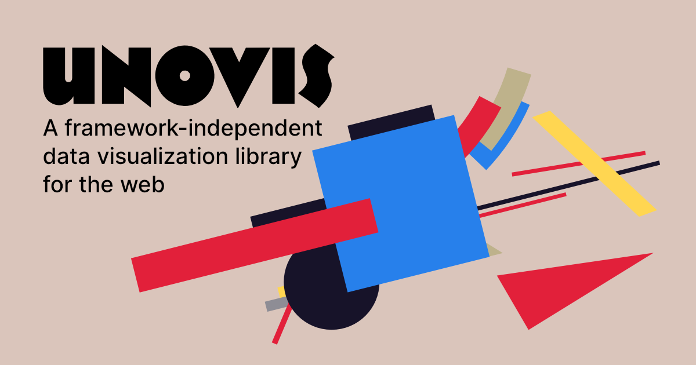

#  🥳 Say hi to Unovis 👋

### We’re excited to announce Unovis 1.0 - a modular data visualization framework for React, Angular, Svelte, and vanilla TypeScript or JavaScript!

After more than 3 years in development, _Unovis_ finally goes open source. _Unovis_ can draw charts, maps and network graphs, no matter what UI framework you use. We’ve been using it extensively at [F5](https://f5.com/) with Angular and React apps, and it now empowers user interfaces of F5 Distributed Cloud console and NGINX Controller.

### Why Unovis?
*  🏗 Integrates nicely with the UI framework of your choice, making it very easy to use;
*  🗺 Supports various charts, simple and detailed maps, network graphs and diagrams;
*  💇 Highly customizable, thanks to the extensive use of CSS variables;
* 📖 Extensive documentation and growing gallery of examples.

### Want to give it try?
Go to [unovis.dev](https://unovis.dev/), check out the [docs](https://unovis.dev/docs/intro), explore the [gallery](https://unovis.dev/gallery), or jump right into development with our [Quick Start guide](https://unovis.dev/docs/quick-start/).
